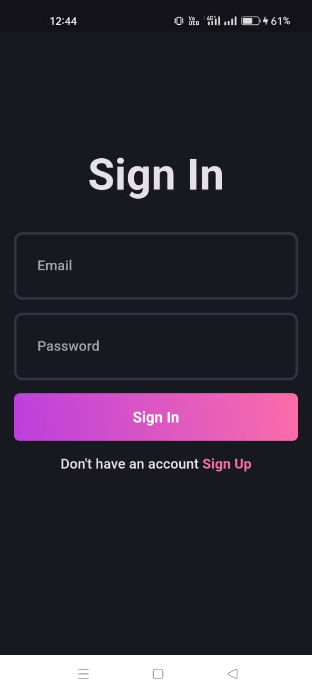
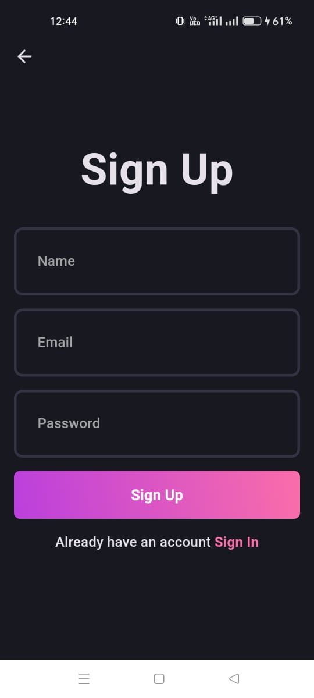
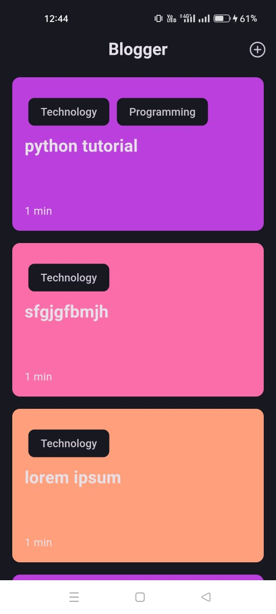
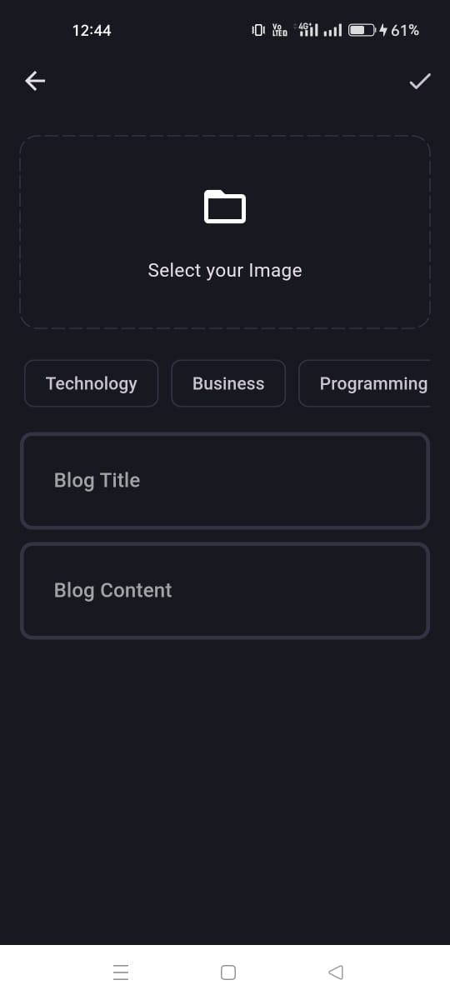
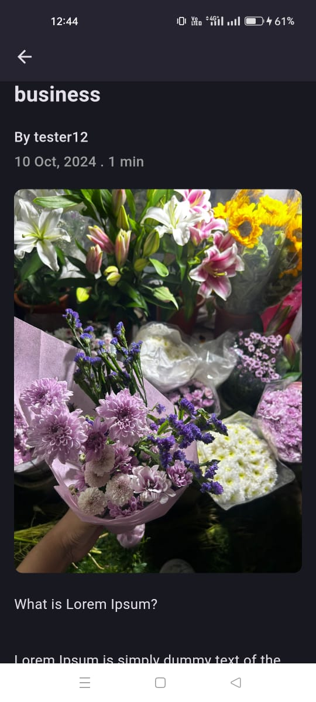

# Blogger

This is a Blog app made with flutter as frontend and Supabase as backend service.Bloc is used for state management and clean architecture is followed throughout entire project.Supabase is used for authentication, uploading and fetching blogs from the database.

#

Packages and Plugins used-

#

1. path_provider
2. flutter_bloc
3. hive
4. get_it
5. supabase_flutter
6. image_picker

#

Features-

#

1. Sign in and Register users.
2. Fetch all blogs from Supabase database.
3. Allow users to add new blogs from the device.
4. Allow users to add properties such as blog title, image and content.
5. Offline viewing of blogs when internet connection is not present.Blogs uploaded from supabase are stored inside local storage through Hive.
6. State persistence added so that user details are saved and current user isn't logged out when app is restarted.

## Demo

https://drive.google.com/file/d/1B0HZNl0qLzJHiMKPhqy9B0DUsKzSSA29/view?usp=sharing

## Screenshots

### Sign In Page

### Sign Up Page

### Blog Viewer Page

### Add New Blog Page

### New Blog Page

